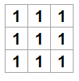
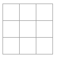

# Bases de la bibliothèque React.js

## INTRO

Je suis en train d'apprendre depuis le 11/09/2024 à utiliser la bibliothèque React.js.
Ce cours est traduit de la page officielle du tutoriel de React.js ce qui me permet de mieux comprendre les choses tout en travaillant mon Anglais.

## Tuto : react tic tac toe

Pour réaliser le tic tac toe nous nous rendons sur le site https://react.dev/learn/tutorial-tic-tac-toe et nous téléchargeons le fichier Zip afin de pouvoir comprendre comment fonctionne React.js.

## Analyse du code

Les fichiers React son des fichiers js qui intègrent du html (composants JSX).
Ici dans le dossier ``src`` nous avons un fichier ``styles.css`` qui est déjà préconfiguré. Nous utiliserons ces classes pour réaliser le tutoriel.

Le fichier ``index.js`` constitue le pont entre le composant qui à été crée dans le fichier ``App.js`` et le navigateur. Nous le modifierons pas dans ce tutoriel.

Le fichier ``App.js`` nous crée ici un composant. Dans React, un composant est un morceau de code réutilisable qui représente une partie d'une interface utilisateur. Les composants sont utilisés pour restituer, gérer et mettre à jour les éléments d'interface utilisateur de votre application.

## Création de la grille du jeu

Pour pouvoir créer le jeu nous aurons besoin ici de boutons de forme carré avec à l'interieur soit un ``X`` soit un ``O``. Nous réalisons tout d'abord la grille en déclarant une fonction nommée `'Square'` qui nous retourne un bouton en html (composant JSX). Nous constatons ici qu'il est impossible de faire succéder les boutons d'une manière simple. Pour pouvoir faire succéder les boutons ils nous faut utiliser les fragments ``<> </>`` pour encapsuler plusieurs éléments JSX adjacents.

Une fois touts nos boutons crées (9 boutons au total pour faire 3 lignes de 3) nous constatons que les boutons son alignés et non placés comme une vraie grille de tic tac toe. Pour remédier à celà nous allons utiliser la classe css ``board-row`` sur des éléments ``div`` qui engloberons 3 boutons à chaque fois:

```js
export default function Square() {
  return(
    <>

    <div className="board-row">
        <button className="square">1</button>
        <button className="square">2</button>
        <button className="square">3</button>
    </div>

    <div className="board-row">
        <button className="square">4</button>
        <button className="square">5</button>
        <button className="square">6</button>
    </div>

    <div className="board-row">
        <button className="square">7</button>
        <button className="square">8</button>
        <button className="square">9</button>
    </div>

    </>
      ) ; 
}
```

Nous pouvons alors renommer notre fonction ``'Square'`` en ``'Board'`` puisqu'il ne s'agit pas que d'un simple carré mais bien d'un plateau de jeu.

Nous pouvons aussi simplifier le code en créant une nouvelle fonction nommée ``Square``:

```js
function Square(){
  return(
    <button className="square">1</button>
  );
}
// ...
```

Cette fonction contient donc un bouton toujours avec la classe css ``square`` mais cette fois-ci nous allons directement interagir avec la fonction ``Board`` et insérer cette même fonction à la place de nos 9 carrés:

```js
// ...
export default function Board() {
  return(
    <>

    <div className="board-row">
      <Square />
      <Square />
      <Square />
    </div>

    <div className="board-row">
      <Square />
      <Square />
      <Square />
    </div>

    <div className="board-row">
      <Square />
      <Square />
      <Square />
    </div>

    </>
      ) ; 
}
```

Ce qui nous donne : 



Petit problème donc... Nous souhaitons ici que les nombres ne soient pas tous les mêmes... 

## Passer de la data a travers les props

Il nous faudra donc ici faire passer une valeur à la fonction ``Square`` pour cela, ajoutons ``{value}`` entre les parenthèses de la fonction. Cela permettra d'indiquer que le composant ``Square`` peut recevoir une propriété appelé ``value``.

❗**Si nous essayons ici d'insérer ''value''' à l'interieur de notre bouton, nous n'obtiendrons pas la valeur du composant Square mais un bouton avec écris à l'interieur ''value''**

Pour pouvoir lire la valeur que nous voulons insérer dans notre bouton, nous indiquons donc ici entre ``{ }`` à l'interieur de notre bouton notre valeur:

```js
function Square({ value }) {
  return <button className="square">{value}</button>;
}
```

Ce qui nous donne maintenant ceci :



On avance, on avance mais c'est pas encore ça...

Pour pouvoir afficher une valeur en particulier dans un composant Square il faut lui indiquer quelle valeur entrer. Pour celà c'est facile, il suffit d'ajouter la propriété ``value`` à chaque composant ``Square`` précedemments crées dans le composant ``Board`` suivi de sa valeur:

```js
export default function Board() {
  return(
    <>

    <div className="board-row">
      <Square value="1"/>
      <Square value="2" />
      <Square value="3" />
    </div>

    <div className="board-row">
      <Square value="4"/>
      <Square value="5" />
      <Square value="6" />
    </div>

    <div className="board-row">
      <Square value="7"/>
      <Square value="8" />
      <Square value="9" />
    </div>

    </>
      ) ; 
}
```

## Composants réactifs

❗ En cours d'apprentissage et d'écriture. ❗